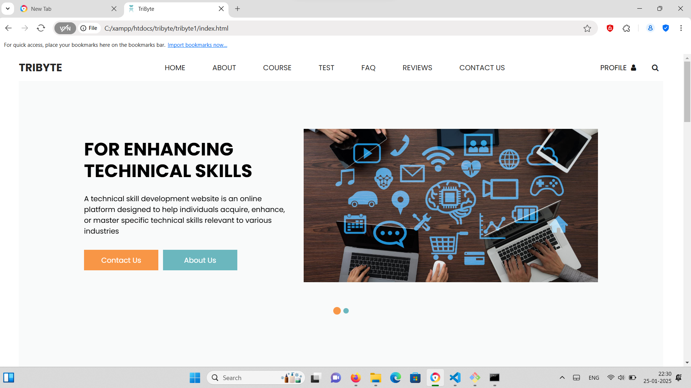
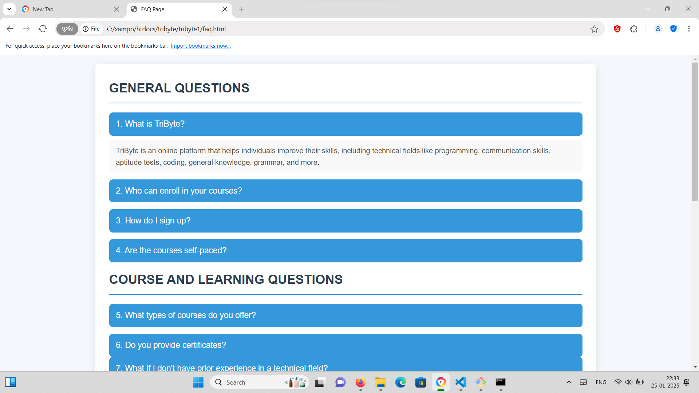
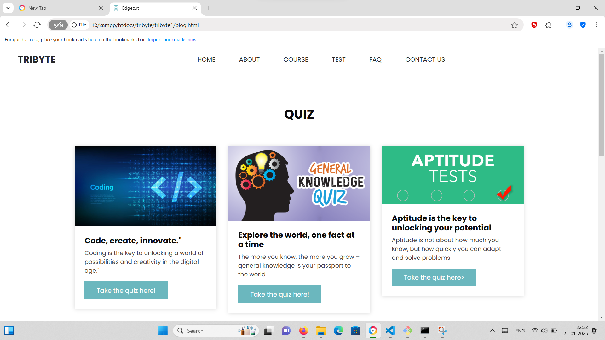

# TriByte 🎯

## Basic Details
### Team Name: TriByte

### Team Members
- Member 1: Anusha Antony - Vidya Academy of Science and technology,Thrissur
- Member 2: Anamika A B - Vidya Academy of Science and technology,Thrissur
- Member 3: Anargha V P - Vidya Academy of Science and technology,Thrissur

### Hosted Project Link
https://anusha-antony.github.io/tribyte/

### Project Description
TriByte is atrusted platform for mastering technical skills and unlocking new opportunities. Our mission is to empower individuals and professionals by providing access to world-class training in the most in-demand technical fields.

### The Problem statement
To develop a website for improving technical skills.

### The Solution
made a website which assures all the functionalities like technical quizzes,learning videos and successfull stories

## Technical Details
### Technologies/Components Used
For Software:
- [Html]
- [css]
- [Javascript ]
- [Bootstrap]

# Screenshots (Add at least 3)

### Project Demo
# Video
https://drive.google.com/file/d/1-1es46MxeXxWSqL1_rkI0WRxsu74EL69/view?usp=sharing

## Team Contributions
- [Name 1]: [Anusha Antony]
- [Name 2]: [Anargha V P]
- [Name 3]: [Anamika A B]

